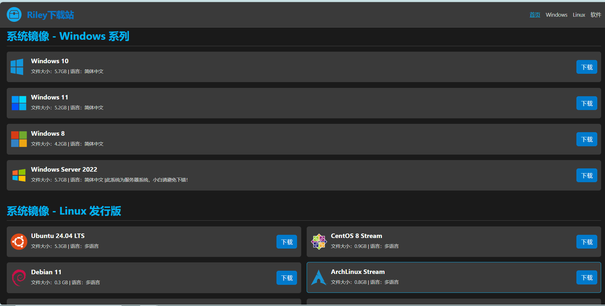
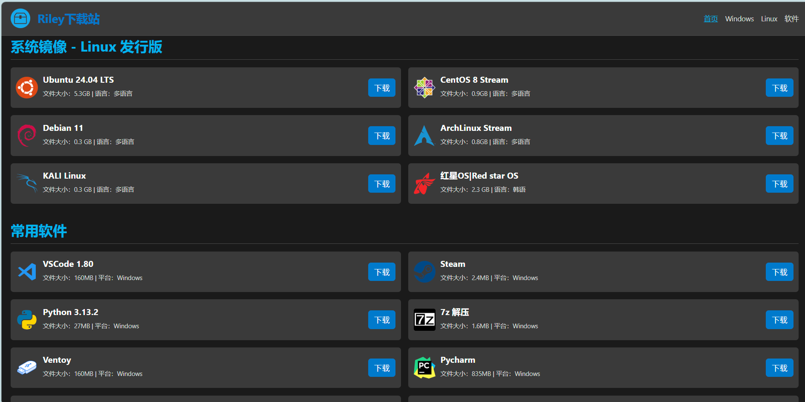
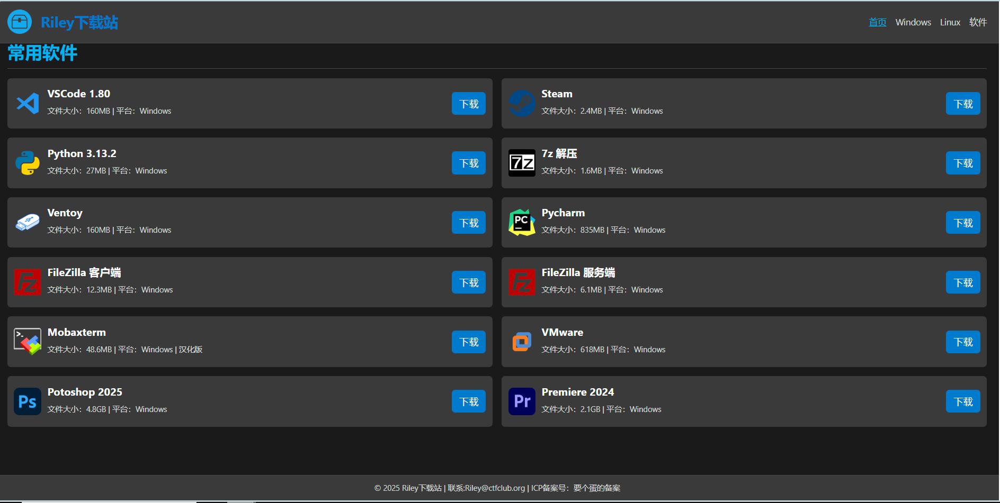
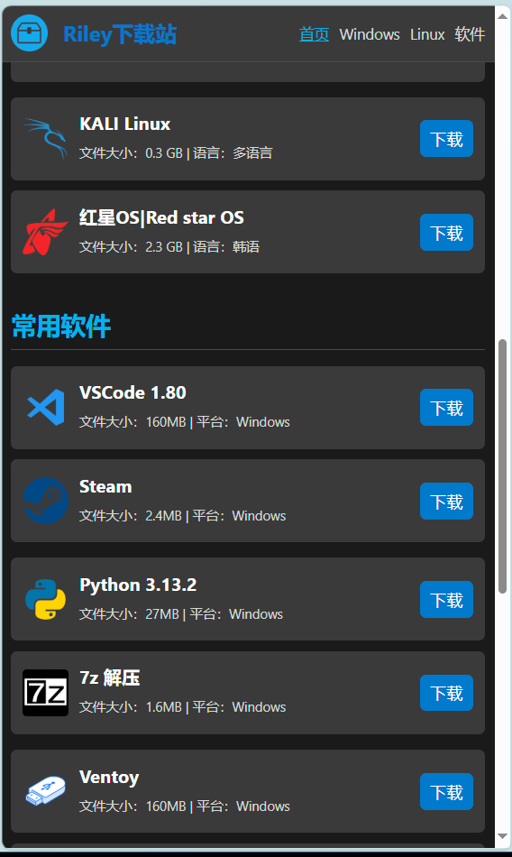

# 🚀 Riley 下载站网站预览

✨ **Riley 下载站** 是一个由 Riley - 莱利开发的响应式静态资源站网页。以下是网站的预览图和相关介绍：

## 🌐 网站访问链接
[点击访问 Riley 下载站](https://www.openufs.com)

## 📸 网站截图
以下是一些网站的截图，展示网站的部分界面和功能：

## 📖 关于本站
- **开发者**：Riley - 莱利（网名，别问我真名，我可是个神秘人 😎）
- **类型**：静态资源站网页
- **特点**：全站无毒无广告，提供多种系统镜像和常用软件下载
- **部署方式**：可通过 GitHub Pages 或 Cloudflare Workers 部署
- **可自定义**：可通过修改页面代码来展示自己想展示的内容

## 🛠️ 技术栈
- **HTML/CSS**：用于构建静态网页结构和样式
- **GitHub Pages/Cloudflare Workers**：用于部署和托管网页

## 📚 主要功能
1. **系统镜像下载**：提供多种 Windows 和 Linux 系统镜像下载，满足不同用户需求
   - Windows 系列（Windows 10、Windows 11、Windows 8、Windows Server 2022）
   - Linux 发行版（Ubuntu、CentOS、Debian、ArchLinux、KALI Linux 等）
2. **常用软件下载**：涵盖各类常用软件，如 VSCode、Steam、Python、7z 解压、Ventoy 等
3. **网站自定义**：修改页面代码就像写故事一样，你可以随意添加或删除资源信息。只要你会一点 HTML，就能轻松搞定。是不是很简单？
4. **简单部署**：支持通过 GitHub Pages 或 Cloudflare Workers 快速部署

## 🔄 持续更新

我们会不断更新网站内容，带来更多新鲜好玩的资源。记得经常来看看哦！说不定下次就有你想要的那款软件了。如果有任何建议或需求，欢迎在群里告诉我们，我们会尽力满足大家的需求。

## ⚠️ 注意事项
- 本站所有内容仅供学习和研究使用，请在下载和使用时遵守相关法律法规
- 如果你发现任何问题或有好的建议，欢迎加入本站官方交流群（QQ 群号：[点击加入](http://qm.qq.com/cgi-bin/qm/qr?_wv=1027&k=171gJxCFR2t-LBIlKKzg7oyh-wO32dtF&authKey=%2BttEuP4h1pI0dgC6ELOfNIJKKntLPTAjoi7mDifdesNFi%2BxP1vBwPeGN4w73Nelt&noverify=0&group_code=727496785)）与我们交流

## 🎉 联系我们
如果对本网站有任何问题、建议或反馈，可以通过以下方式联系我们：
- **官方交流群**：QQ 群号：727496785
- **开发者**：Riley - 莱利 邮箱：riley@ctfclub.org

快来访问 Riley 下载站，体验优质的资源下载服务吧！🎉